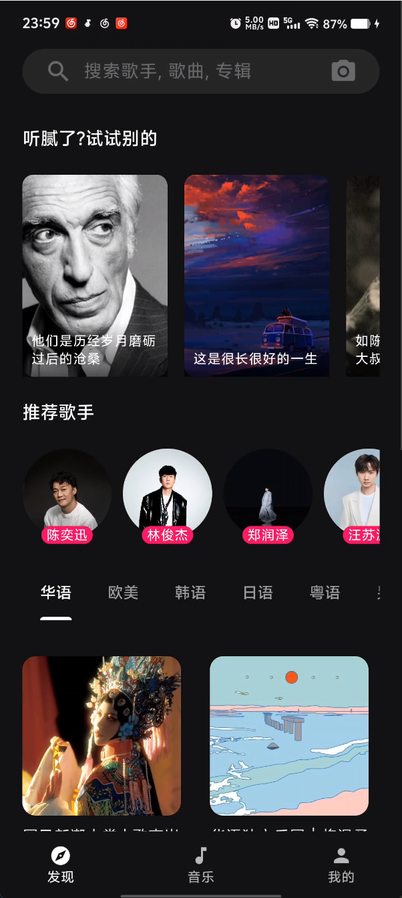
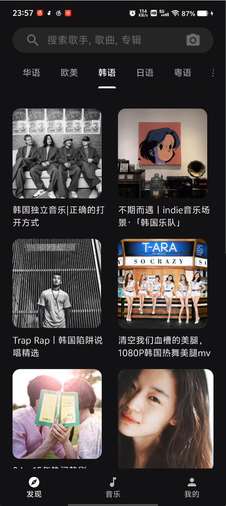
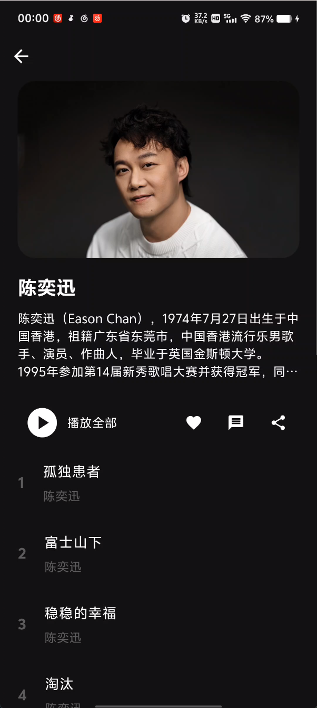
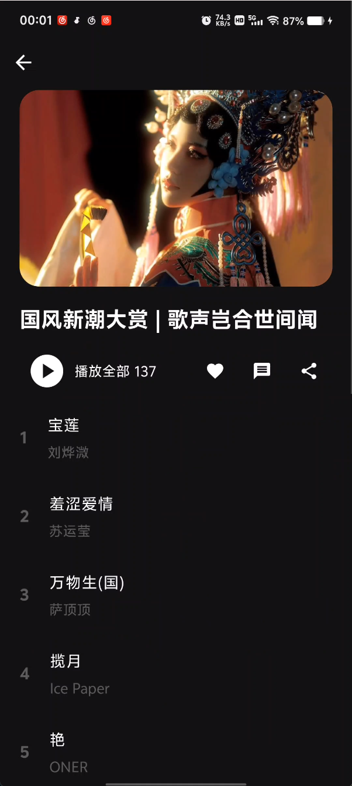
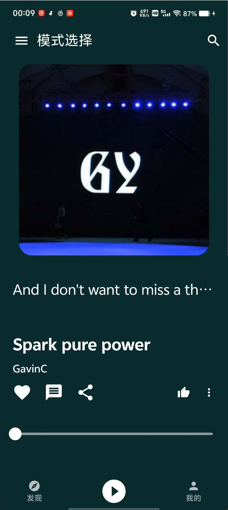
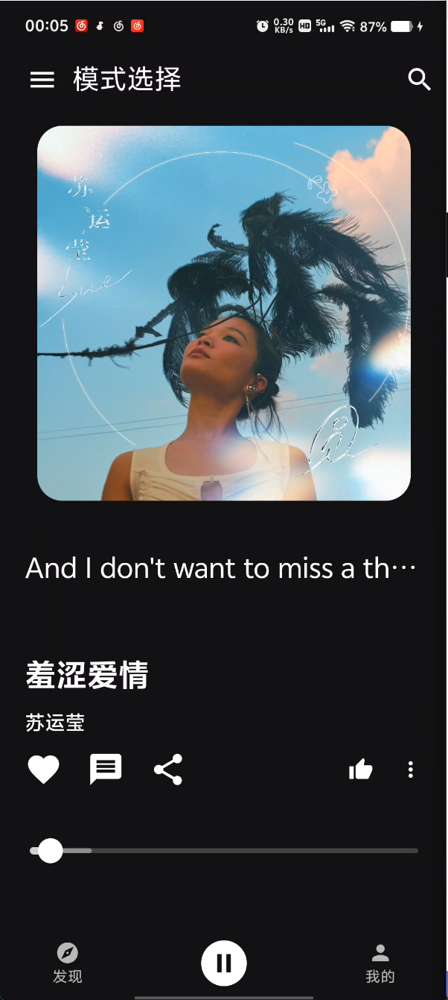
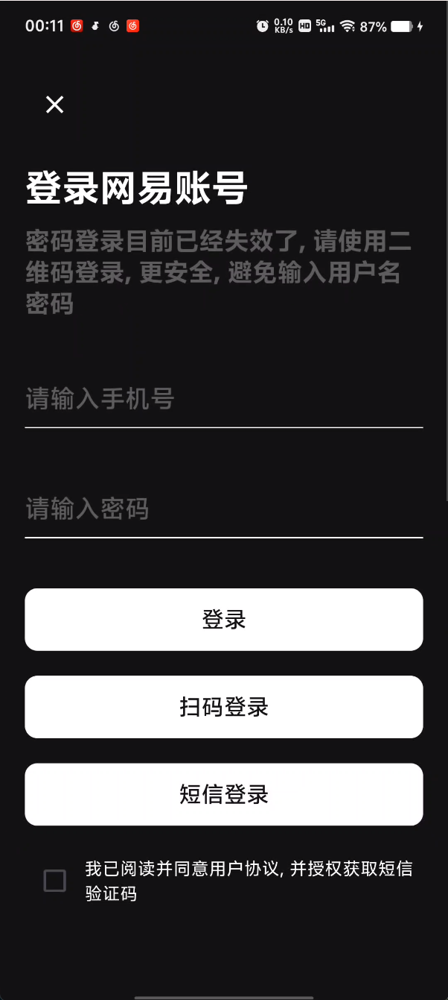
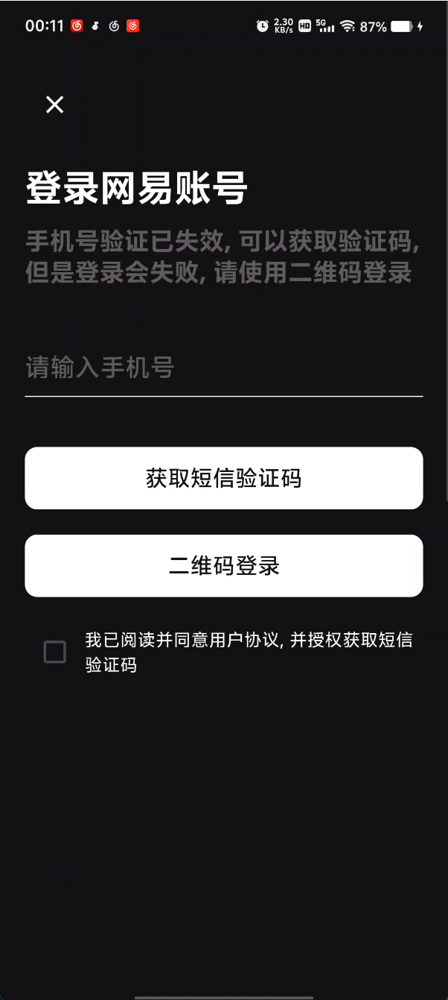
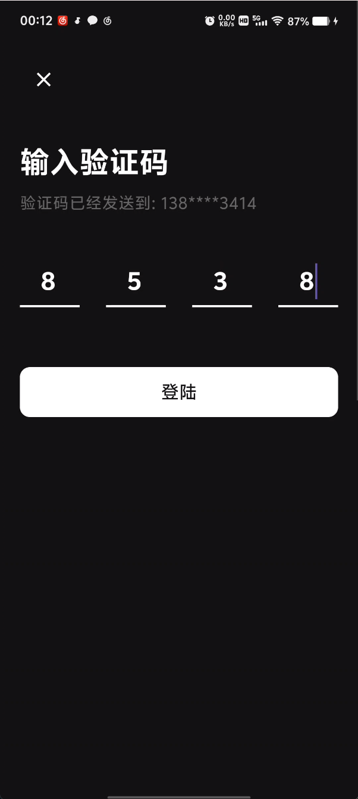

# AiMusic

一款音乐app，交互模仿汽水音乐。[更多内容](https://aidaole.github.io/#/)

**项目介绍**

此项目为纯**Flutter**项目, 使用主要框架:

- Dio 封装网络请求
- dio_cookie_manager 管理账户cookie信息
- Bloc 状态管理
- JustAudio 音频播放
- qr_flutter 二维码扫描, 做登录验证
- flutter_bloc 状态管理
- cached_network_image 图片缓存
- shimmer 图片加载动画
- palette_generator 颜色提取

环境配置:

```
Flutter 3.24.5 • channel stable • https://github.com/flutter/flutter.git
Tools • Dart 3.5.4 • DevTools 2.37.3
```

**服务端接口说明**

项目中使用的服务端接口均来自于 [NeteaseCloudMusicApi](https://binaryify.github.io/NeteaseCloudMusicApi) , 感谢作者的无私分享。

本地搭建服务端环境请自行在电脑中安装nodejs环境, 然后使用以下命令运行NeteaseCloudMusicApi即可

```
npx NeteaseCloudMusicApi@latest
```

然后将项目中 `dio_utils.dart` 文件中的 `_baseUrl` 改成电脑的ip地址+端口，即可通过手机访问

项目中目前使用的是本人的服务器, 不保证长期可用.

## 功能展示

1. 首页三tab布局
2. 音乐播放主控界面，滑动切歌
3. 发现页面，热门歌单, 热门歌手, 推荐歌单等
4. 登录,包含账号密码登录(失效)，验证码登录(失效), 二维码登录(可用, 使用网易云音乐扫描二维码登录)

后续还有新功能，陆续添加

发现页面,支持嵌套滑动, 歌单详情页, 滑动吸顶等

<div>
     
    
     
     
</div>

播放页面,沉浸式背景,随机颜色,中间tab底部bar修改为播放按钮, 上下滑动切歌, 预览进度, 拖动控制等

<div>
     
     
</div>

登录相关, 账号密码登录(失效), 验证码登录(失效), 二维码登录(可用, 使用网易云音乐扫描二维码登录)

<div>
     
     
     
     
</div>


